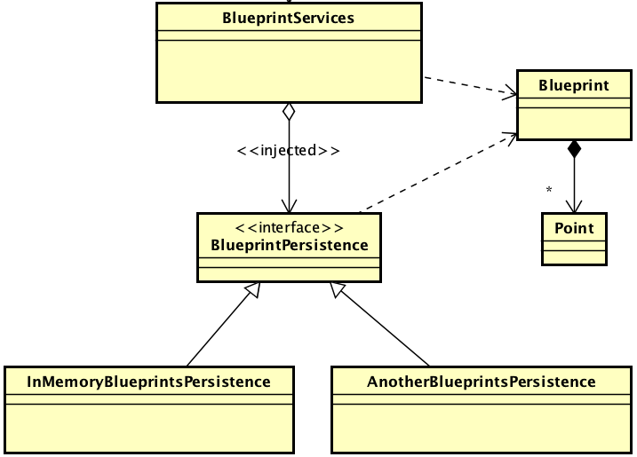

# ARSW-Lab04

**Colombian School of Engineering Julio Garavito**  
**Software Architectures - ARSW**  
**Laboratory Number 4**

**Members:**
- Juan Esteban Medina Rivas
- María Paula Sánchez Macías

---

## Part 0 - aditional basic exercise

> To illustrate the use of the Spring framework and the development environment for using it through Maven (and NetBeans), we will configure a text analysis application that uses a grammar checker that requires a spell checker. The required spell checker will be injected into the grammar checker at runtime (for now, there are two available: English and Spanish).

First, we had to open the project with NetBeans


> Second, we checked that the Spring configuration file already included in the project (src/main/resources). It indicates that Spring will automatically search for the 'Beans' available in the specified package.


> Third, we had o use the annotation-based Spring configuration, mark the dependencies that must be injected with the @Autowired and @Service annotations, and the candidate beans to be injected, respectively.

- GrammarChecker will be a bean, which has a dependency of type ‘SpellChecker’.
- EnglishSpellChecker and SpanishSpellChecker are the two possible candidates to be injected. You must select one or the other, but NOT both (there would be a dependency resolution conflict). For now, use EnglishSpellChecker.

We use *@Service("spanishSpellChecker")* and *@Service("englishSpellChecker")* to solve the conflicts and then *@Qualifier("englishSpellChecker")*


> we created a test program where an instance of GrammarChecker is created using Spring, and then used:

```java
public static void main(String[] args) {
	ApplicationContext ac=new ClassPathXmlApplicationContext("applicationContext.xml");
	GrammarChecker gc=ac.getBean(GrammarChecker.class);
	System.out.println(gc.check("la la la "));
}
```

> we modified the configuration with annotations so that the Bean ‘GrammarChecker’ now uses the SpanishSpellChecker class (so that GrammarChecker is injected with EnglishSpellChecker instead of SpanishSpellChecker). Verify the new result.

**Spanish Spell Checker Test**


**English Spell Checker Test**


---

## Componentes y conectores - Parte I.

El ejercicio se debe traer terminado para el siguiente laboratorio (Parte II).


#### Middleware- gestión de planos.


## Antes de hacer este ejercicio, realice [el ejercicio introductorio al manejo de Spring y la configuración basada en anotaciones](https://github.com/ARSW-ECI/Spring_LightweightCont_Annotation-DI_Example).

En este ejercicio se va a construír un modelo de clases para la capa lógica de una aplicación que permita gestionar planos arquitectónicos de una prestigiosa compañia de diseño. 



1. Configure la aplicación para que funcione bajo un esquema de inyección de dependencias, tal como se muestra en el diagrama anterior.


	Lo anterior requiere:

	* Agregar las dependencias de Spring.
	* Agregar la configuración de Spring.
	* Configurar la aplicación -mediante anotaciones- para que el esquema de persistencia sea inyectado al momento de ser creado el bean 'BlueprintServices'.


2. Complete los operaciones getBluePrint() y getBlueprintsByAuthor(). Implemente todo lo requerido de las capas inferiores (por ahora, el esquema de persistencia disponible 'InMemoryBlueprintPersistence') agregando las pruebas correspondientes en 'InMemoryPersistenceTest'.

3. Haga un programa en el que cree (mediante Spring) una instancia de BlueprintServices, y rectifique la funcionalidad del mismo: registrar planos, consultar planos, registrar planos específicos, etc.

4. Se quiere que las operaciones de consulta de planos realicen un proceso de filtrado, antes de retornar los planos consultados. Dichos filtros lo que buscan es reducir el tamaño de los planos, removiendo datos redundantes o simplemente submuestrando, antes de retornarlos. Ajuste la aplicación (agregando las abstracciones e implementaciones que considere) para que a la clase BlueprintServices se le inyecte uno de dos posibles 'filtros' (o eventuales futuros filtros). No se contempla el uso de más de uno a la vez:
	* (A) Filtrado de redundancias: suprime del plano los puntos consecutivos que sean repetidos.
	* (B) Filtrado de submuestreo: suprime 1 de cada 2 puntos del plano, de manera intercalada.

5. Agrege las pruebas correspondientes a cada uno de estos filtros, y pruebe su funcionamiento en el programa de prueba, comprobando que sólo cambiando la posición de las anotaciones -sin cambiar nada más-, el programa retorne los planos filtrados de la manera (A) o de la manera (B). 
